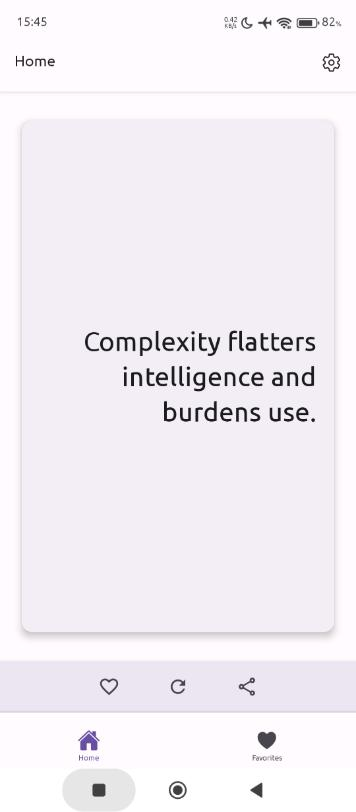
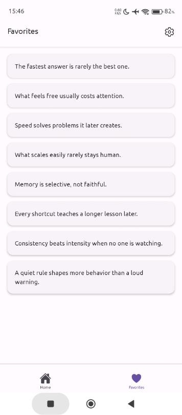
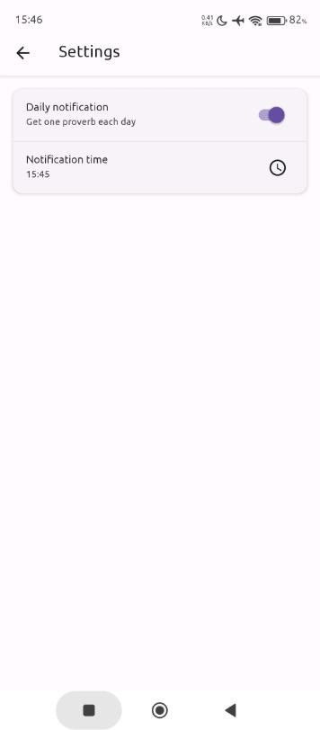

Proverb Daily shows one short proverb each day in a clean, distraction-free format.

Open the app to read the day’s 21st century proverb. That’s it.

Features

- One proverb notification per day
- Offline access once installed
- Optional daily reminder
- Light and dark mode

Privacy

- No account required
- No personal data collected
  -All content is stored locally

This app is designed for quick, calm use — under a minute a day.

---

#### Proverb Screen

#### Favorited Proverb

#### One Favorited Proverb

#### List of Favorited Proverbs

#### Notification Settings

